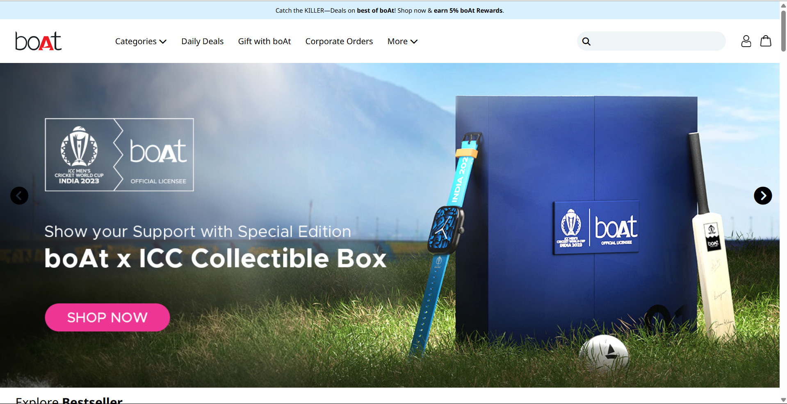
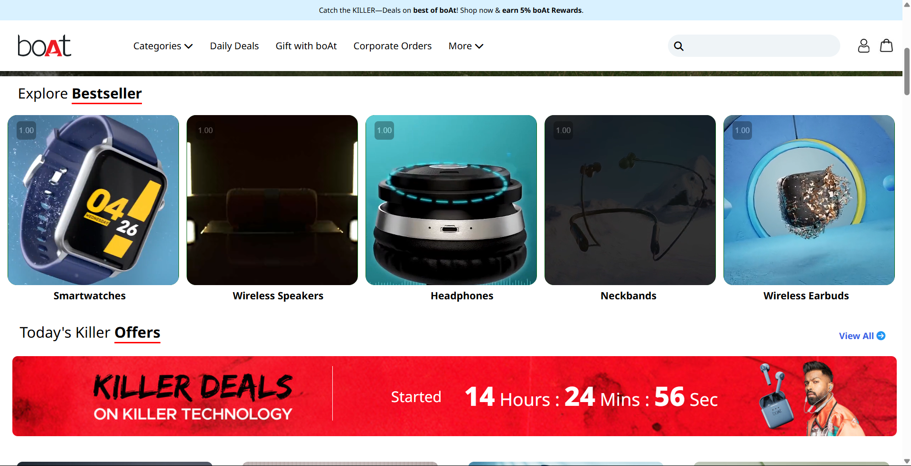
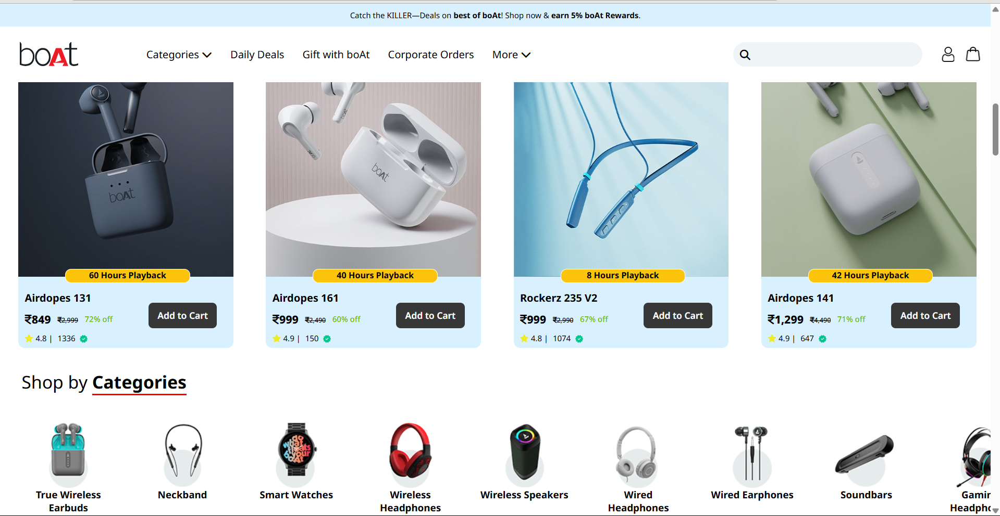
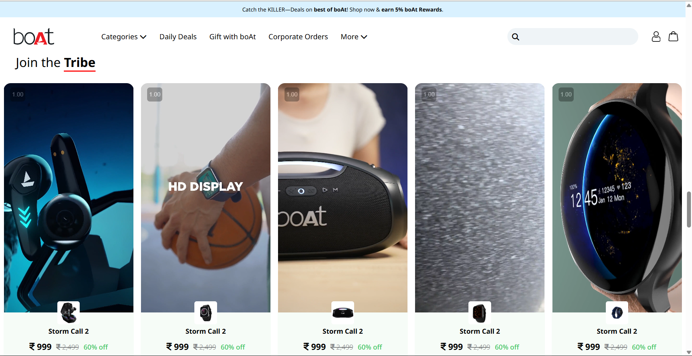
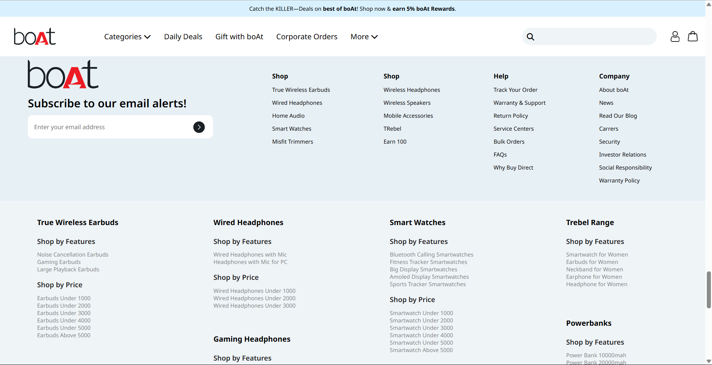

# Boat Website

A React-based clone of the UI design of the Boat website, showcasing a modern and responsive e-commerce layout.

[Live Demo](https://boat-react-app.netlify.app/)

---

## Overview
This project replicates the UI of the Boat website, focusing on:
- Clean and responsive design.
- React components for modular development.
- Modern e-commerce website layout and structure.

---

## Features
- **Responsive Design:** Optimized for desktop, tablet, and mobile devices.
- **Reusable Components:** Built using React for scalability.
- **Modern UI:** Clean and attractive e-commerce interface.

---

## Technologies Used

### Frontend
- **React:** Component-based UI development.
- **CSS3:** Styling and responsiveness.
- **JavaScript (ES6+):** Dynamic functionality and interactivity.

### Dependencies
```json
"dependencies": {
    "@testing-library/jest-dom": "^5.17.0",
    "@testing-library/react": "^13.4.0",
    "@testing-library/user-event": "^13.5.0",
    "react": "^18.2.0",
    "react-dom": "^18.2.0",
    "react-scripts": "5.0.1",
    "web-vitals": "^2.1.4"
}
```

### Hosting
- Hosted on Netlify: [Live Demo](https://boat-react-app.netlify.app/)

---

## Installation

### Steps
1. Clone the repository:
   ```bash
   git clone https://github.com/your-username/boat-ui-clone.git
   ```

2. Navigate to the project directory:
   ```bash
   cd boat-ui-clone
   ```

3. Install dependencies:
   ```bash
   npm install
   ```

4. Start the development server:
   ```bash
   npm start
   ```

---

## How It Works
1. **React Components:** Modular design ensures scalability and reusability.
2. **Responsive Layout:** CSS media queries handle device-specific adjustments.
3. **Modern Framework:** Utilizes React for fast rendering and interactive UI.

---

## Preview






---

## Future Improvements
- Add product filtering and search functionality.
- Integrate a backend for dynamic data rendering.
- Implement user authentication for personalized experiences.

---

## Contribution
Contributions are welcome! Feel free to fork the repository and submit a pull request.

---

## Contact
For queries or feedback, please contact [Shubham](mailto:shubhamjaishu@gmail.com).
